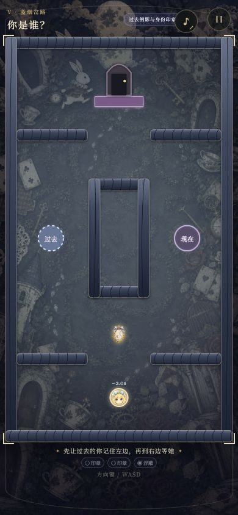
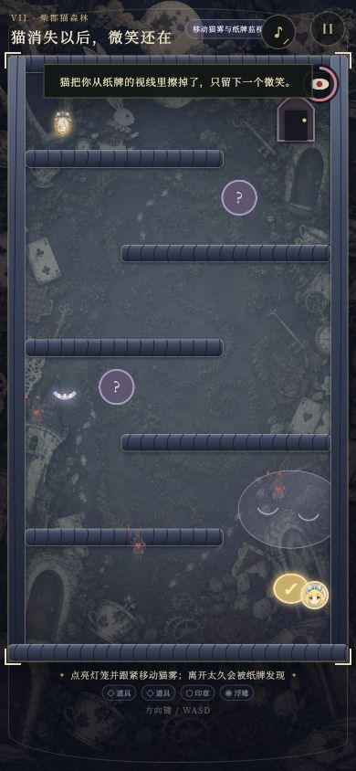

<div align="center">

# 兔子洞尽头

### After the Rabbit Hole

一款通过倾斜手机操控爱丽丝 Q 版头像的 H5 重力冒险游戏。

在会改变方向、尺寸、时间与身份的梦境花园里，<br>
找回被兔子洞藏起来的名字。

[在线游玩](https://sakurakoujihakuya.github.io/After-the-Rabbit-Hole/) ·
[关卡设计](./GAME_DESIGN.md) ·
[报告问题](https://github.com/SakurakoujiHakuya/After-the-Rabbit-Hole/issues)


</div>

> “出口并不在门后。出口在她重新说出自己名字的那一刻。”

## 掉进兔子洞

《兔子洞尽头》是一款原创的爱丽丝式暗童话 H5 游戏。玩家控制的不是普通小球，而是爱丽丝遗失在梦里的记忆化身。倾斜手机，或者使用虚拟摇杆与键盘，让她穿过一座规则不断改口的花园。

游戏包含纵向下坠、重力迷宫、大小变化、镜面反转、茶杯传送、槌球弹射、纸牌巡逻、过去倒影与猫雾潜行等玩法。每条完整路线约有 11 个章节，并包含两处分支选择。

## 梦境实录

| 过去与现在 | 柴郡猫的雾 |
| --- | --- |
|  |  |
| 两秒前的爱丽丝会重走旧路，与现在的自己同时回答“我是谁”。 | 跟随移动猫雾避开纸牌视线，离开雾太久就会被发现。 |

## 游戏特色

- **倾斜世界**：使用 `DeviceOrientationEvent` 将手机姿态转换为重力。
- **多种控制方式**：支持方向传感器、触摸摇杆、方向键和 `WASD`。
- **过去倒影**：两秒前的移动轨迹会成为可见实体，并参与双印章谜题。
- **猫雾潜行**：移动安全区、阶段纸牌与警觉值组成完整的护送关卡。
- **规则失常**：左右反转、变大变小、动态墙、传送杯和旋转房间。
- **轻叙事分支**：关前对白、关中事件、隐藏兔子浮雕与分支遗产。
- **移动端优先**：以 `390 × 844` 和竖屏操作为主要体验基准。

## 操作方式

| 平台 | 操作 |
| --- | --- |
| iPhone / Android | 倾斜手机 |
| 触摸屏降级模式 | 拖动左下角虚拟摇杆 |
| PC 调试 | 方向键或 `WASD` |

iOS Safari 只允许 HTTPS 页面读取方向传感器，并且必须由用户点击按钮主动授权。普通 HTTP 局域网地址无法获得该权限，但仍可使用虚拟摇杆。

横屏不是主要游玩方式，建议保持手机竖屏。

## 本地运行

环境要求：Node.js 22 或更高版本。

```bash
git clone git@github.com:SakurakoujiHakuya/After-the-Rabbit-Hole.git
cd After-the-Rabbit-Hole
npm install
npm run dev
```

Vite 会输出：

```text
Local:   http://localhost:5173/
Network: http://你的局域网地址:5173/
```

手机与电脑连接同一 Wi-Fi 后，可打开 `Network` 地址使用触摸控制。要测试 iPhone 重力感应，请使用线上 HTTPS 地址。

开发时可直接进入指定关卡：

```text
http://localhost:5173/?level=caterpillar-crossroad
http://localhost:5173/?level=cheshire-wood
```

## 技术结构

```text
src/
├── App.jsx          页面流程、权限、叙事与状态
├── GameCanvas.jsx   Canvas 绘制和逐帧游戏循环
├── gameEngine.js    物理、碰撞与机制纯函数
├── levels.js        数据驱动的关卡配置
└── progress.js      本地存档、分支与评价

tests/
├── gameEngine.test.js
├── levels.test.js
└── progress.test.js
```

主要技术：

- React 19
- Vite 8
- Canvas 2D
- Device Orientation API
- Node.js Test Runner
- GitHub Actions / GitHub Pages

## 测试与构建

```bash
npm test
npm run build
```

测试覆盖物理碰撞、倒影插值、猫雾路径、警觉状态、开关语义、动态机关、物件间距、分支存档及所有关卡组合的可达性。

## 部署

推送到 `main` 后，GitHub Actions 会自动：

1. 安装依赖。
2. 运行完整测试。
3. 构建生产版本。
4. 部署到 GitHub Pages。

线上地址：

https://sakurakoujihakuya.github.io/After-the-Rabbit-Hole/

## License

本项目使用 [MIT License](./LICENSE) 开源。
